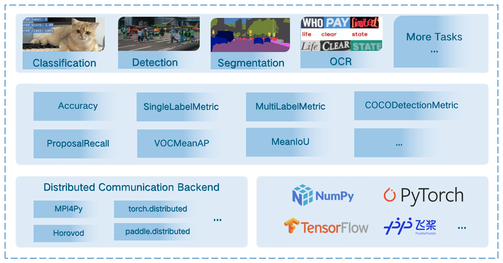

<div align="center">
  
  <div>&nbsp;</div>
  <div align="center">
    <b><font size="5">OpenMMLab website</font></b>
    <sup>
      <a href="https://openmmlab.com">
        <i><font size="4">HOT</font></i>
      </a>
    </sup>
    &nbsp;&nbsp;&nbsp;&nbsp;
    <b><font size="5">OpenMMLab platform</font></b>
    <sup>
      <a href="https://platform.openmmlab.com">
        <i><font size="4">TRY IT OUT</font></i>
      </a>
    </sup>
  </div>
  <div>&nbsp;</div>

[](https://pypi.org/project/mmeval/)
[](https://pypi.org/project/mmeval)
[](https://github.com/open-mmlab/mmeval/blob/main/LICENSE)
[](https://github.com/open-mmlab/mmeval/issues)
[](https://github.com/open-mmlab/mmeval/issues)

[🤔Reporting Issues](https://github.com/open-mmlab/mmeval/issues/new/choose)

</div>

<div align="center">

English | [简体中文](README_zh-CN.md)

</div>

## Introduction

MMEval is a machine learning evaluation library that supports efficient and accurate distributed evaluation on a variety of machine learning frameworks.

Major features:

- Comprehensive metrics for various computer vision tasks (NLP will be covered soon!)
- Efficient and accurate distributed evaluation, backed by multiple distributed communication backends
- Support multiple machine learning frameworks via dynamic input dispatching mechanism

<div  align="center">
  
</div>

<details>
<summary> Supported distributed communication backends </summary>

|                                                                       MPI4Py                                                                       |                                                                                                                                                  torch.distributed                                                                                                                                                   |                                                                         Horovod                                                                          |                                                                 paddle.distributed                                                                 |
| :------------------------------------------------------------------------------------------------------------------------------------------------: | :------------------------------------------------------------------------------------------------------------------------------------------------------------------------------------------------------------------------------------------------------------------------------------------------------------------: | :------------------------------------------------------------------------------------------------------------------------------------------------------: | :------------------------------------------------------------------------------------------------------------------------------------------------: |
| [MPI4PyDist](https://mmeval.readthedocs.io/en/latest/api/generated/mmeval.core.dist_backends.MPI4PyDist.html#mmeval.core.dist_backends.MPI4PyDist) | [TorchCPUDist](https://mmeval.readthedocs.io/en/latest/api/generated/mmeval.core.dist_backends.MPI4PyDist.html#mmeval.core.dist_backends.TorchCPUDist) <br> [TorchCUDADist](https://mmeval.readthedocs.io/en/latest/api/generated/mmeval.core.dist_backends.MPI4PyDist.html#mmeval.core.dist_backends.TorchCUDADist) | [TFHorovodDist](https://mmeval.readthedocs.io/en/latest/api/generated/mmeval.core.dist_backends.MPI4PyDist.html#mmeval.core.dist_backends.TFHorovodDist) | [PaddleDist](https://mmeval.readthedocs.io/en/latest/api/generated/mmeval.core.dist_backends.MPI4PyDist.html#mmeval.core.dist_backends.PaddleDist) |

</details>

<details>
<summary> Supported metrics and ML frameworks </summary>

`NOTE: MMEval tested with PyTorch 1.6+, TensorFlow 2.4+ and Paddle 2.2+.`

|                                                                         Metric                                                                          | numpy.ndarray | torch.Tensor | tensorflow.Tensor | paddle.Tensor |
| :-----------------------------------------------------------------------------------------------------------------------------------------------------: | :-----------: | :----------: | :---------------: | :-----------: |
|                 [Accuracy](https://mmeval.readthedocs.io/en/latest/api/generated/mmeval.metrics.Accuracy.html#mmeval.metrics.Accuracy)                  |       ✔       |      ✔       |         ✔         |       ✔       |
|    [SingleLabelMetric](https://mmeval.readthedocs.io/en/latest/api/generated/mmeval.metrics.SingleLabelMetric.html#mmeval.metrics.SingleLabelMetric)    |       ✔       |      ✔       |                   |               |
|     [MultiLabelMetric](https://mmeval.readthedocs.io/en/latest/api/generated/mmeval.metrics.MultiLabelMetric.html#mmeval.metrics.MultiLabelMetric)      |       ✔       |      ✔       |                   |               |
|     [AveragePrecision](https://mmeval.readthedocs.io/en/latest/api/generated/mmeval.metrics.AveragePrecision.html#mmeval.metrics.AveragePrecision)      |       ✔       |      ✔       |                   |               |
|                   [MeanIoU](https://mmeval.readthedocs.io/en/latest/api/generated/mmeval.metrics.MeanIoU.html#mmeval.metrics.MeanIoU)                   |       ✔       |      ✔       |         ✔         |       ✔       |
|                [VOCMeanAP](https://mmeval.readthedocs.io/en/latest/api/generated/mmeval.metrics.VOCMeanAP.html#mmeval.metrics.VOCMeanAP)                |       ✔       |              |                   |               |
|                [OIDMeanAP](https://mmeval.readthedocs.io/en/latest/api/generated/mmeval.metrics.OIDMeanAP.html#mmeval.metrics.OIDMeanAP)                |       ✔       |              |                   |               |
| [CocoDetectionMetric](https://mmeval.readthedocs.io/en/latest/api/generated/mmeval.metrics.COCODetectionMetric.html#mmeval.metrics.COCODetectionMetric) |       ✔       |              |                   |               |
|        [ProposalRecall](https://mmeval.readthedocs.io/en/latest/api/generated/mmeval.metrics.ProposalRecall.html#mmeval.metrics.ProposalRecall)         |       ✔       |              |                   |               |
|                 [F1Metric](https://mmeval.readthedocs.io/en/latest/api/generated/mmeval.metrics.F1Metric.html#mmeval.metrics.F1Metric)                  |       ✔       |      ✔       |                   |               |
|                 [HmeanIoU](https://mmeval.readthedocs.io/en/latest/api/generated/mmeval.metrics.HmeanIoU.html#mmeval.metrics.HmeanIoU)                  |       ✔       |              |                   |               |
|             [PCKAccuracy](https://mmeval.readthedocs.io/en/latest/api/generated/mmeval.metrics.PCKAccuracy.html#mmeval.metrics.PCKAccuracy)             |       ✔       |              |                   |               |
|       [MpiiPCKAccuracy](https://mmeval.readthedocs.io/en/latest/api/generated/mmeval.metrics.MpiiPCKAccuracy.html#mmeval.metrics.MpiiPCKAccuracy)       |       ✔       |              |                   |               |
|     [JhmdbPCKAccuracy](https://mmeval.readthedocs.io/en/latest/api/generated/mmeval.metrics.JhmdbPCKAccuracy.html#mmeval.metrics.JhmdbPCKAccuracy)      |       ✔       |              |                   |               |
|          [EndPointError](https://mmeval.readthedocs.io/en/latest/api/generated/mmeval.metrics.EndPointError.html#mmeval.metrics.EndPointError)          |       ✔       |      ✔       |                   |               |
|                [AVAMeanAP](https://mmeval.readthedocs.io/en/latest/api/generated/mmeval.metrics.AVAMeanAP.html#mmeval.metrics.AVAMeanAP)                |       ✔       |              |                   |               |
|                       [SSIM](https://mmeval.readthedocs.io/en/latest/api/generated/mmeval.metrics.SSIM.html#mmeval.metrics.SSIM)                        |       ✔       |              |                   |               |
|                         [SNR](https://mmeval.readthedocs.io/en/latest/api/generated/mmeval.metrics.SNR.html#mmeval.metrics.SNR)                         |       ✔       |              |                   |               |
|                       [PSNR](https://mmeval.readthedocs.io/en/latest/api/generated/mmeval.metrics.PSNR.html#mmeval.metrics.PSNR)                        |       ✔       |              |                   |               |
|                         [MAE](https://mmeval.readthedocs.io/en/latest/api/generated/mmeval.metrics.MAE.html#mmeval.metrics.MAE)                         |       ✔       |              |                   |               |
|                         [MSE](https://mmeval.readthedocs.io/en/latest/api/generated/mmeval.metrics.MSE.html#mmeval.metrics.MSE)                         |       ✔       |              |                   |               |

</details>

## Installation

`MMEval` requires Python 3.6+ and can be installed via pip.

```bash
pip install mmeval
```

To install the dependencies required for all the metrics provided in `MMEval`, you can install them with the following command.

```bash
pip install 'mmeval[all]'
```

## Get Started

There are two ways to use `MMEval`'s metrics, using `Accuracy` as an example:

```python
from mmeval import Accuracy
import numpy as np

accuracy = Accuracy()
```

The first way is to directly call the instantiated `Accuracy` object to calculate the metric.

```python
labels = np.asarray([0, 1, 2, 3])
preds = np.asarray([0, 2, 1, 3])
accuracy(preds, labels)
# {'top1': 0.5}
```

The second way is to calculate the metric after accumulating data from multiple batches.

```python
for i in range(10):
    labels = np.random.randint(0, 4, size=(100, ))
    predicts = np.random.randint(0, 4, size=(100, ))
    accuracy.add(predicts, labels)

accuracy.compute()
# {'top1': ...}
```

## Learn More

<details>
<summary>Tutorials</summary>

- [Implementing a Metric](https://mmeval.readthedocs.io/en/latest/tutorials/custom_metric.html)
- [Using Distributed Evaluation](https://mmeval.readthedocs.io/en/latest/tutorials/dist_evaluation.html)

</details>

<details>
<summary>Examples</summary>

- [MMCls](https://mmeval.readthedocs.io/en/latest/examples/mmclassification.html)
- [TensorPack](https://mmeval.readthedocs.io/en/latest/examples/tensorpack.html)
- [PaddleSeg](https://mmeval.readthedocs.io/en/latest/examples/paddleseg.html)

</details>

<details>
<summary>Design</summary>

- [BaseMetric Design](https://mmeval.readthedocs.io/en/latest/design/base_metric.html)
- [Distributed Communication Backend](https://mmeval.readthedocs.io/en/latest/design/distributed_backend.html)
- [Multiple Dispatch](https://mmeval.readthedocs.io/en/latest/design/multiple_dispatch.html)

</details>

## In the works

- Continue to add more metrics and expand more tasks (e.g. NLP, audio).
- Support more ML frameworks and explore multiple ML framework support paradigms.

## Contributing

We appreciate all contributions to improve MMEval. Please refer to [CONTRIBUTING.md](CONTRIBUTING.md) for the contributing guideline.

## License

This project is released under the [Apache 2.0 license](LICENSE).

## Projects in OpenMMLab

- [MMEngine](https://github.com/open-mmlab/mmengine): OpenMMLab foundational library for training deep learning models.
- [MIM](https://github.com/open-mmlab/mim): MIM installs OpenMMLab packages.
- [MMCV](https://github.com/open-mmlab/mmcv): OpenMMLab foundational library for computer vision.
- [MMClassification](https://github.com/open-mmlab/mmclassification): OpenMMLab image classification toolbox and benchmark.
- [MMDetection](https://github.com/open-mmlab/mmdetection): OpenMMLab detection toolbox and benchmark.
- [MMDetection3D](https://github.com/open-mmlab/mmdetection3d): OpenMMLab's next-generation platform for general 3D object detection.
- [MMRotate](https://github.com/open-mmlab/mmrotate): OpenMMLab rotated object detection toolbox and benchmark.
- [MMYOLO](https://github.com/open-mmlab/mmyolo): OpenMMLab YOLO series toolbox and benchmark.
- [MMSegmentation](https://github.com/open-mmlab/mmsegmentation): OpenMMLab semantic segmentation toolbox and benchmark.
- [MMOCR](https://github.com/open-mmlab/mmocr): OpenMMLab text detection, recognition, and understanding toolbox.
- [MMPose](https://github.com/open-mmlab/mmpose): OpenMMLab pose estimation toolbox and benchmark.
- [MMHuman3D](https://github.com/open-mmlab/mmhuman3d): OpenMMLab 3D human parametric model toolbox and benchmark.
- [MMSelfSup](https://github.com/open-mmlab/mmselfsup): OpenMMLab self-supervised learning toolbox and benchmark.
- [MMRazor](https://github.com/open-mmlab/mmrazor): OpenMMLab model compression toolbox and benchmark.
- [MMFewShot](https://github.com/open-mmlab/mmfewshot): OpenMMLab fewshot learning toolbox and benchmark.
- [MMAction2](https://github.com/open-mmlab/mmaction2): OpenMMLab's next-generation action understanding toolbox and benchmark.
- [MMTracking](https://github.com/open-mmlab/mmtracking): OpenMMLab video perception toolbox and benchmark.
- [MMFlow](https://github.com/open-mmlab/mmflow): OpenMMLab optical flow toolbox and benchmark.
- [MMEditing](https://github.com/open-mmlab/mmediting): OpenMMLab image and video editing toolbox.
- [MMGeneration](https://github.com/open-mmlab/mmgeneration): OpenMMLab image and video generative models toolbox.
- [MMDeploy](https://github.com/open-mmlab/mmdeploy): OpenMMLab model deployment framework.
