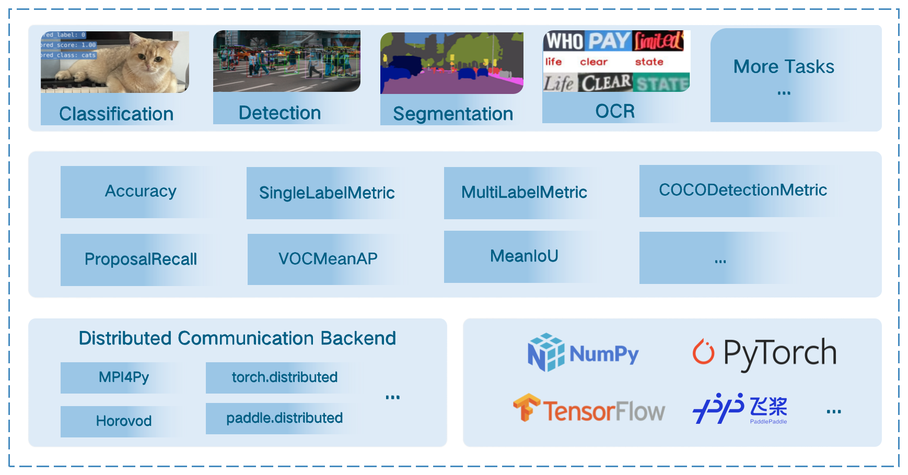

# Introduction

MMEval is a machine learning evaluation library that supports efficient and accurate distributed evaluation on a variety of machine learning frameworks.

Major features:

- Comprehensive metrics for various computer vision tasks (NLP will be covered soon!)
- Efficient and accurate distributed evaluation, backed by multiple distributed communication backends
- Support multiple machine learning frameworks via dynamic input dispatching mechanism

